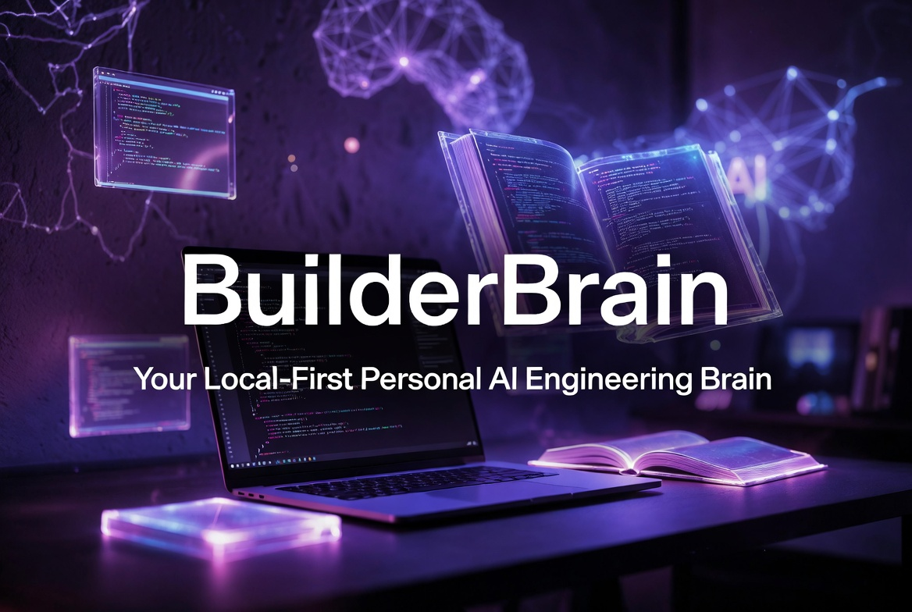
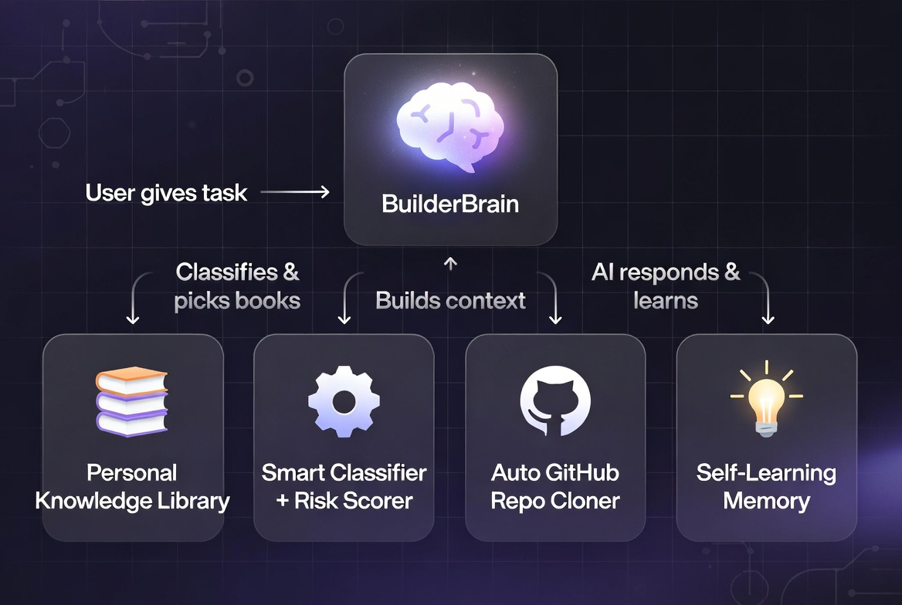
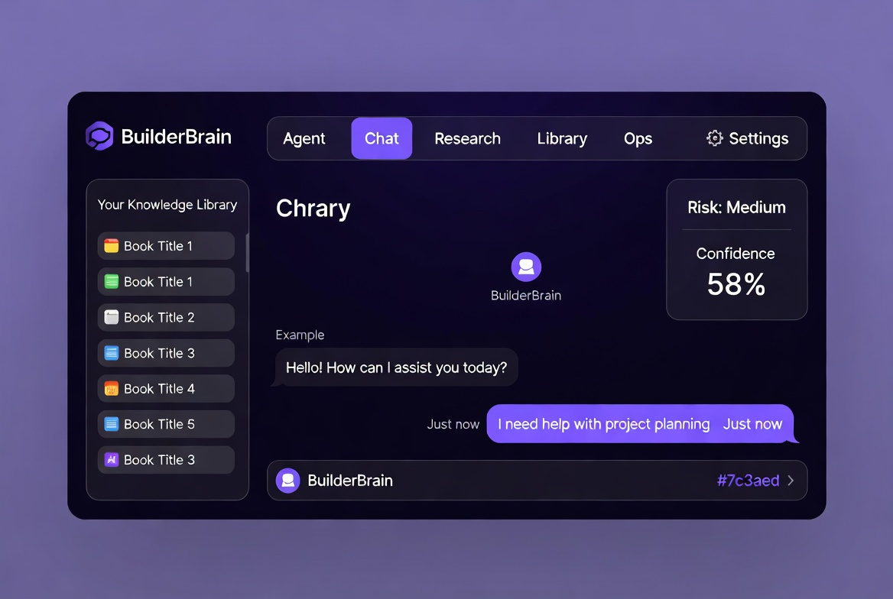

# LIBRARY-MCP



**BuilderBrain** — Your Local-First Personal AI Engineering Brain

A powerful, private, local-first AI assistant that runs entirely on your machine. It combines a rich personal knowledge library with intelligent agents, multi-AI chat, automatic repo cloning, and MCP (Model Context Protocol) support.

## 🚀 What is BuilderBrain?

BuilderBrain is like having a **super-smart coding partner and personal librarian** living on your laptop.

It knows your personal "books" (curated knowledge, rules, past lessons, and your working style). When you give it a task, it classifies the task, picks the right books, checks risk, builds smart context, and can even **automatically clone GitHub repos** from chat. It also learns and remembers how *you* like to work.

One app. One port (`http://localhost:8765`). Multiple powerful modes.



## ✨ Key Features

- **🧠 Intelligent Context Engine** — 14-domain classifier + book router + risk scorer
- **📚 Personal Knowledge Library** — 20+ seeded books
- **💬 Smart Multi-AI Chat** — Strong system prompt + auto repo cloning
- **🤖 Agentic Workflows** — Proposal engine + self-learning memory
- **🖥️ Beautiful React Dashboard** — 6 clean modes
- **🔌 MCP Ready** — Works with the new Model Context Protocol
- **📥 One-Click Repo Cloning** — Just paste a GitHub link in chat
- **🚀 Cross-Platform Launchers** — Works on Windows, macOS, Linux
- **🔒 Fully Local & Private**

## 🏃 Quick Start

### One-Click Launch (Recommended)

```bash
git clone https://github.com/mohitnigahcanada-collab/LIBRARY-MCP.git
cd LIBRARY-MCP

# Linux
chmod +x LaunchBrain.sh && ./LaunchBrain.sh

# macOS → double-click LaunchBrain.command
# Windows → double-click LaunchBrain.bat
```

### Manual Start

```bash
cd builderbrain
npm install
npm run build:all
npm start
```

Open **http://localhost:8765**

## 🧭 The 6 Modes

| Mode       | What it does |
|------------|--------------|
| **Agent**  | Task proposals, context packs, risk assessment |
| **Chat**   | Natural conversation + auto repo cloning |
| **Research** | (Coming soon) Web + GitHub search |
| **Library**  | Browse books + cloned repos |
| **Ops**    | Logs, analytics, backend |
| **Settings** | API keys & preferences |



## 🏗️ Architecture

```
LIBRARY-MCP/
├── builderbrain/
│   ├── src/          # API, CLI, engines, memory, MCP
│   ├── dashboard/    # React frontend
│   └── brain-data/   # Your private library + cloned repos
├── LaunchBrain.*     # One-click launchers
└── PROGRESS.md       # Full development log
```

## 🔌 Current MCP Tools

- `brain_context_pack`
- `brain_propose`
- `brain_save_lesson`
- `brain_status`

## 📡 Main API Endpoints

| Endpoint       | Method | Purpose                     |
|----------------|--------|-----------------------------|
| `/health`      | GET    | Health check                |
| `/status`      | GET    | Stats                       |
| `/context`     | POST   | Build context pack          |
| `/propose`     | POST   | Task proposal + risk        |
| `/chat`        | POST   | Chat with auto-cloning      |
| `/repo/clone`  | POST   | Clone any GitHub repo       |

## 🛠️ Tech Stack

TypeScript • Hono • React + Vite • Vercel AI SDK • Vitest • Commander

## 🔮 Roadmap (Next Big Things)

- Daily trend radar + alerts
- Task queue system
- Real Research mode
- Auto repo analysis after cloning
- Better memory & RAG

See `PROGRESS.md` for the full list.

## 🤝 Contributing

Ideas and improvements are welcome!  
Fork → Branch → Pull Request

## 📄 License

Currently unlicensed (personal project).

## 🙏 Built with ❤️ by Mohit Nigah

Inspired by the Model Context Protocol and the dream of a truly personal AI brain that remembers you.

---

**Ready to build smarter?**  
Start the brain → `http://localhost:8765`
